# Compose Doc

## docker-compose run flow

dockercompose practice note, git pull to C:\Users\git\DockerStack and start

### run container

```powershell
# run container
docker-compose up

# run container 背景執行 Detached Mode 避免佔據當前終端
docker-compose up -d

# run container 指定 Project name 而不使用當前資料夾名稱
docker-compose -p carcare up -d

# Linux/macOS agent pipeline 指定 Project name
export COMPOSE_PROJECT_NAME=$(projectName)

# Windows agent pipeline 指定 Project name
# by powshershell
$env:COMPOSE_PROJECT_NAME = "$(projectName)"
# by cmd
set COMPOSE_PROJECT_NAME=$(projectName)

# 指定 compose 位置
docker-compose -f ./Web/docker-compose.yml up -d
docker-compose -f ./WinService/docker-compose.yml up -d
```

1. 可以版控 container 執行的參數(對外port、環境變數、是否背景執行等)
2. 依賴可執行的 image，執行 container 取代 Dockerfile cli
3. 組成 container 模式，故會形成叢集資料夾 container 分層方式顯示


到 C:\Users\git\DockerStack\Volumes

開始所有 compose file 的維護與執行

### before run

確定拿到的是最新的 image `docker-compose pull`

刪掉 **所有「未被容器使用的 image」**，包含你之前 build 或 pull 下來、但目前沒有 container 用到的

### after run

確定本地沒有用不到的 `image docker image prune -a -f`

## azure agent and docker registry

```powershell
cd C:\Users\git\DockerStack\Volumes\azure-agent
# build image
docker build . -t azure-agent:dev
# run container
docker-compose up -d
```

### azure agent Node version management

#### Dockerfile 預先安裝 Node.js

```dockerfile
# 安裝 curl 與 node.js
RUN apt-get update && \
    apt-get install -y curl gnupg && \
    curl -fsSL https://deb.nodesource.com/setup_18.x | bash - && \
    apt-get install -y nodejs=18.20.6-1nodesource1 && \
    node -v && npm -v
```

確保版本固定、pipeline 快速啟動，但是多專案共用 agent 會有切換版本的提。

#### Pipeline 中動態安裝

優點：移植性佳、支援 cache
缺點：首次執行會下載安裝，稍慢

```yaml
- task: UseNode@1
  displayName: 'Install Node.js 18.20.6'
  inputs:
    version: '18.20.6'
    # 避免版本飄移。
    checkLatest: false
```

#### NVM 整合與使用

如 Agent 中已整合 [nvm](https://github.com/nvm-sh/nvm)，可在 pipeline 使用 script 切換版本

優點：靈活支援多版本、自建 agent 易整合
缺點：須明確 source `.nvm.sh` 並控制 PATH

```yaml
- script: |
    export NVM_DIR="$HOME/.nvm"
    [ -s "$NVM_DIR/nvm.sh" ] && \. "$NVM_DIR/nvm.sh"

    nvm install 18.20.6
    nvm use 18.20.6
    node --version
    displayName: 'Use Node.js via NVM'
```

## docker registry

1. cd 到 complose 位置

   cd C:\Users\git\DockerStack\Volumes\dockerrepos

2. 檢查 complose 存在

   `ls`

3. 執行

   `docker-compose up -d`

4. 檢查容器是否執行

   `docker ps`

#### 查看現有 registry image

```powershell
curl http://localhost:5000/v2/_catalog
```

#### 查看現有 image 現有 tag

```powershell
curl http://localhost:5000/v2/imagename/tags/list
curl http://localhost:5000/v2/dparcore/tags/list
```

#### vs code ide 方式查看

extension 安裝 

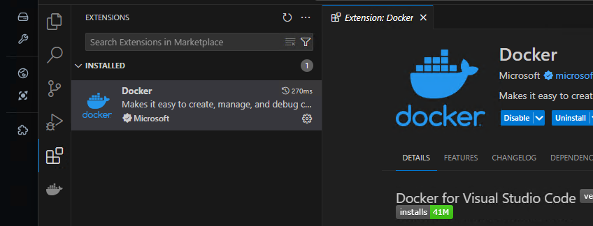 

新增連線

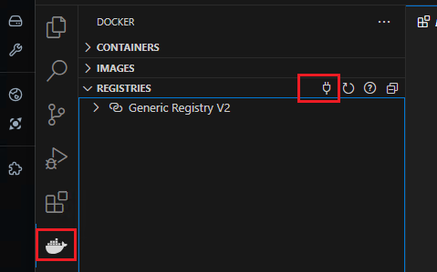 

選擇 v2 

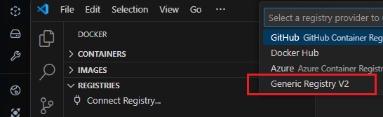 

port 使用 container 對外 port 

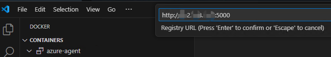 

沒有設置 username 與 passeword 就跳過

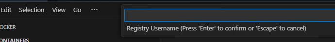 

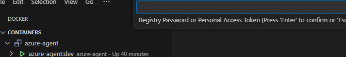 

連上就可以看已經push 的 image

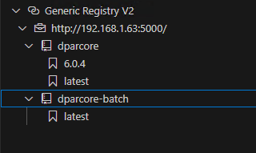 

## BeGat

### BeGat compose build

```powershell
# cd 到 complose 位置
cd C:\Users\git\DockerStack\Volumes\nuget

# 檢查 complose 存在
ls

# 執行
docker-compose up -d

# 檢查容器是否執行
docker ps
```

#### 檢測是否穩定運行

http://localhost:29/

#### 舊主機套件轉移

1. 將舊主機的套件複製packages

2. 套件移動到 Volumes\nuget\Packages

3. ps 路徑執行.`.\SyncSource.ps1`

   可能需要先執行 : Set-ExecutionPolicy -Scope Process -ExecutionPolicy RemoteSigned

   可能需要先下載 nuget.exe https://learn.microsoft.com/zh-tw/nuget/install-nuget-client-tools?tabs=windows

   可能需要去 %APPDATA%/NuGet/NuGet.Config 新增 <add key="63ITSbegat" value="http://192.168.10.10:29/v3/index.json" allowInsecureConnections="True" />

## Redis

### Redis compose build

```powershell
# cd 到 complose 位置
cd C:\Users\git\DockerStack\Volumes\redis\

# 檢查 complose 存在
ls

# 執行
docker-compose up -d

# 檢查容器是否執行
docker ps

# 進入容器 cli 工具
docker exec -it carcare-redis redis-cli -a mysettingpassword

# 進測資
Set name "Amnda"
# 查測資
Get name
```

### 安裝 medis 檢查 redis 安裝狀況

https://github.com/liying2008/medis-binaries/releases

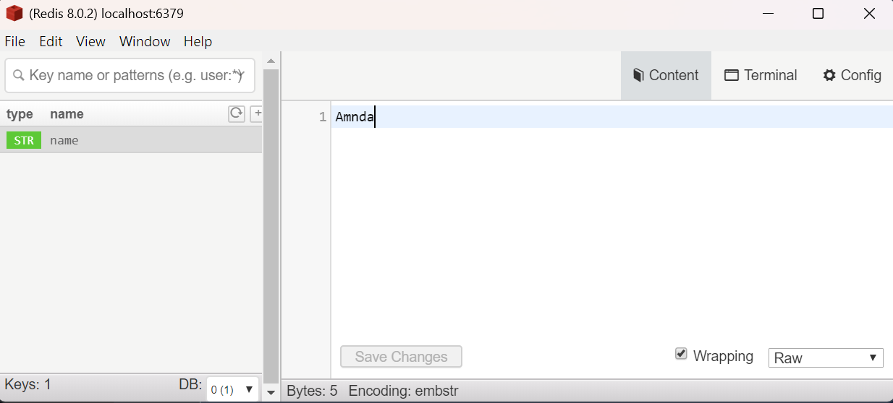

## MySQL

### MySQL compose build

```powershell
# cd 到 complose 位置
cd C:\Users\git\DockerStack\Volumes\mysql

# 檢查 complose 存在
ls

# 執行
docker-compose up -d

# 檢查容器是否執行
docker ps
```

### 測試連線

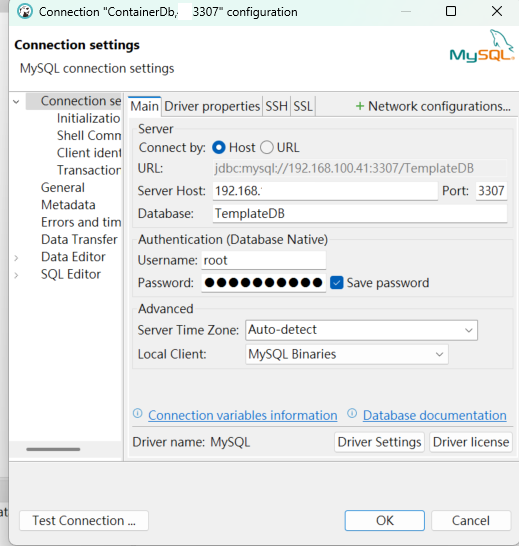 

連線失敗遇到

Public Key Retrieval is not allowed

調整設定

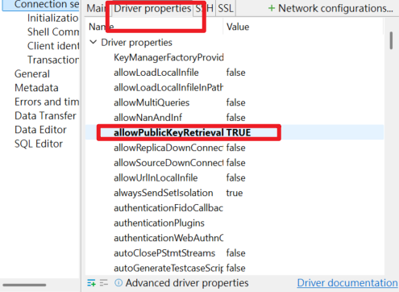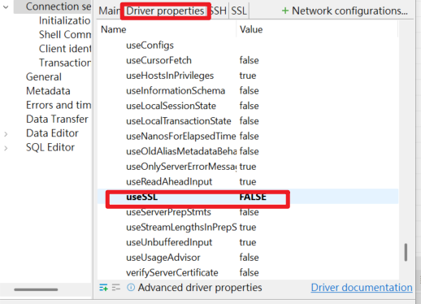 

連線成功

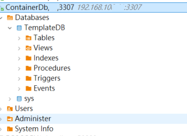 


## MSSQL

### MSSQL compose build

```powershell
# cd 到 complose 位置
cd C:\Users\git\DockerStack\Volumes\mssql

# 檢查 complose 存在
ls

# 執行
docker-compose up -d

# 檢查容器是否執行
docker ps

# 進入容器
docker exec -it sqlserver_1437 bash

# 進入容器使用容器內 cli 工具
docker exec -it sqlserver_1437 /opt/mssql-tools18/bin/sqlcmd -S tcp:localhost  -U sa -P "mysettingpassword" -C
```

#### 測試 SSMS 連線

localhost,1436 

192.168.10.10,1436

sa

mysettingpassword

#### 檢查 mdf、ldf 掛載

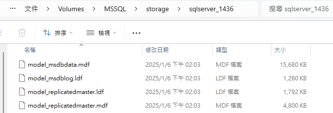 

#### 進入容器

 docker exec -it sqlserver_1437 bash

#### 進入容器 sql cmd

##### server 進入

docker exec -it sqlserver_1437 /opt/mssql-tools/bin/sqlcmd -S tcp:localhost  -U sa -P "mysettingpassword" -C

docker exec -it sqlserver_1437 /opt/mssql-tools18/bin/sqlcmd -S tcp:localhost  -U sa -P "mysettingpassword" -C

docker exec -it sqlserver_1437 /opt/mssql-tools18/bin/sqlcmd -S tcp:localhost  -U sa -P "mysettingpassword" -C -l 30

docker exec -it sqlserver_1437 /opt/mssql-tools18/bin/sqlcmd -S tcp:localhost,1433  -U sa -P "mysettingpassword" -C -l 30

##### 遠端進入

#### 查看檔案

#### 應用程式連線

1. bakpac 還原

   資料庫設定不見

   1. Autogrowth 設定、還原變為預設值

      ```sql
      SELECT
          name AS FileName,
          type_desc AS FileType,
          size / 128 AS CurrentSize_MB,
          growth AS GrowthSetting,
          is_percent_growth AS IsGrowthInPercent
      FROM
          sys.database_files;
      ```

   2. 其他gpt建議檢察(但我檢查沒有變化)

      ```sql
      SELECT name
      , recovery_model_desc
      , compatibility_level
      ,is_auto_close_on
      ,page_verify_option
      FROM sys.databases
      WHERE name = 'DPARCore2';
      ```

      

2. bak 或 bakpac 還原

   需要手動刪除 login

   刪不掉是因為有SCHEMA占用

   檢查占用

   ```sql
   SELECT name AS SchemaName
   FROM sys.schemas
   WHERE principal_id = USER_ID('dpar');
   ```

   刪除占用

   ```sql
   ALTER AUTHORIZATION ON SCHEMA::dpar_schema TO dbo;
   ```

   手動刪除使用者

3. 加回使用者連線

   ```sql
   USE [master]
   GO
   CREATE LOGIN [dpar] WITH PASSWORD=N'dpar', DEFAULT_DATABASE=[master], CHECK_EXPIRATION=OFF, CHECK_POLICY=OFF
   GO
   USE [DPARCore2]
   GO
   CREATE USER [dpar] FOR LOGIN [dpar]
   GO
   USE [DPARCore2]
   GO
   ALTER ROLE [db_owner] ADD MEMBER [dpar]
   GO
   ```

   

## Verdaccio

 

A lightweight Node.js private proxy registry

#### Verdaccio compose build

```cmd
#進入有 compose 的 資料夾
cd C:\Users\git\DockerStack\Volumes\verdaccio

#檢查檔案存在
ls

# run 起來
docker-compose up -d

# 檢查 docker 裡面有增加檔案
#1
docker exec -it verdaccio sh

#2 -a 才可以看到隱藏的檔案
ls -a /verdaccio/storage

```

檢查檔案存在

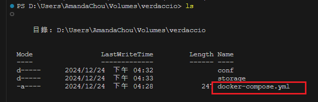 

確保目錄中包含 `docker-compose.yml`

compose up 之後新增了一個 .verdaccio-db.json

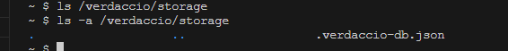 

#### Test into

http://localhost:4873/

local 的 port 4873 對應到 docker container 內部的port  4873

因為compose 設定如此
 ports:

   \- "4873:4873"

## Portainer 

user : admin

pass: itsowermysettingpassword

密碼 必須12字元

### Compose Error

1. port is already allocated

   對外 port 必須唯一，port  號占用會顯示錯誤，回頭修改 compose file

    

2. Docker login Fail

   當多視窗 cli 執行 docker compose 時，可能導致一個 process 背景取得 docker 的 user credential 而其他 process 無法登入

   應盡量避免多 cli 執行

   : failed to resolve reference "docker.io/verdaccio/verdaccio:latest": failed to authorize: failed to fetch oauth token: unexpected status from GET request to https://auth.docker.io/token?scope=repository%3Averdaccio%2Fverdaccio%3Apull&service=registry.docker.io: 401 Unauthorized

   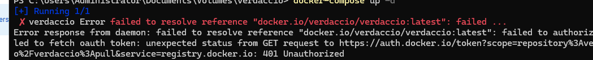 

    `docker login -u loginDockerUser`

   然後輸入密碼

   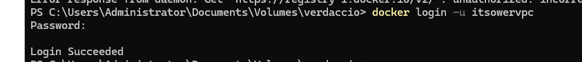 


### compose Resource Limit

限制 container 

```yml
services:
  dparcore-web:
    image: 192.168.10.10:5000/dparcore:latest
    deploy:
      resources:
        limits:
          memory: 1024M 
          cpus: "1"
        reservations:
          memory: 256M
          cpus: "0.5"
```

### compose Log Limit

```yml
services:
  dparcore-web:
    image: 192.168.10.10:5000/dparcore:latest
    logging:
      driver: "json-file"
      options:
        max-size: "10M"
        max-file: 5
```

## Nginx

1. 建立 nginx.conf.template 指定具名路徑 proxy pass 與 根路徑 proxy pass, 並可餐入帶入環境變數
2. 建立 entrypoint.sh 實際作用在於，讀取環境變數，寫入 nginx.conf.template 轉成最終的 nginx default.conf
3. 建立 Dockerfile 依序
   1. 取 nginx image
   2. 載入 nginx.conf.template
   3. 載入 entrypoint.sh
4. docker-compose.yml 傳入所有 nginx.conf.template 需要的參數

### Nginx x Nuxt x .Net Api

nuxt 的 run dev 只吃環境 development

run star 要解決 CORS 又依賴 nginx 所以 .env 用不到

1. local 需要切環境，只能修改 nuxt.config.ts 但小心不要推到版上
2. remote 需要切環境，只能依靠增加 nginx container

###  nginx.conf.template

1. detailedLog 修改 log 格式，詳細列出 porxy 前後規則，並 rename access_log 取代 main log

2. WEB_SCHEMA 彈性化傳入的 http 或 https
   WEB_URL彈性化傳入的 server 與 port，且彈性化可以不輸入指定 port

   ```yaml
   # docker-compose.yml
       environment:
       - WEB_SCHEMA=http
       - WEB_URL=carcare-storeweb:3000
   ```

```nginx
#  nginx.conf.template
log_format  detailedLog  '$remote_addr - $remote_user [$time_local] "$request" '
                  '$status $body_bytes_sent "$http_referer" '
                  '"$http_user_agent" '
                  'host="$host" forwarded_for="$http_x_forwarded_for" '
                  'proxy_host="$proxy_host" proxy_forwarded_for="$proxy_add_x_forwarded_for" '
                  'real_ip="$http_x_real_ip" '
                  'request_time=$request_time '
                  'upstream_addr="$upstream_addr" upstream_status="$upstream_status" '
                  'location="$sent_http_location" '
                  'server_port=$server_port request_uri="$request_uri"';

access_log  /var/log/nginx/access.log  detailedLog;

server {
    listen 80;
    listen [::]:80; 
    server_name localhost;

    location / {
        proxy_pass ${WEB_SCHEMA}://${WEB_URL}/;
        proxy_http_version 1.1;
        proxy_set_header Host $proxy_host;
        proxy_set_header X-Forwarded-For $proxy_add_x_forwarded_for;
        proxy_ssl_server_name on;
        proxy_ssl_verify off;
    }

    location /mainApi/ {
        proxy_pass ${API_SCHEMA}://${API_URL}/;
        proxy_http_version 1.1;
        proxy_set_header Host $proxy_host;
        proxy_set_header X-Real-IP $remote_addr;
        proxy_set_header X-Forwarded-For $proxy_add_x_forwarded_for;
        proxy_ssl_server_name on;
        proxy_ssl_verify off;
    }
}
```

## Seq

```cmd
# cd 到 complose 位置
cd C:\Users\git\DockerStack\Volumes\seq

# 檢查 complose 存在
ls

# 執行
docker-compose up -d

# 檢查容器是否執行
docker ps
```

進入管理頁面
