# Docker

## Concepts

### Docker

- 是一種軟體平台，快速地建立、測試和部署應用程式。

  是一種資源管理的技術，可以將電腦的各種實體資源抽象化後再進行分配

  EX:記憶體、硬碟、網路..。

- 容器（Container）、映像（Image）、Docker 引擎（Docker Engine）、倉庫( **Repository**)

- 虛擬化

### Docker 映像 ( Docker Image )

容器的模板，唯讀，包含應用程序和環境的所有信息。

### Docker 容器 ( Docker Container )

一個輕量、獨立、可執行的軟體包，包括應用程序和其依賴項。

### Docker 引擎( Docker Engine )

Docker的核心組件，用於建立、運行和管理容器，包含多個元件。

1. Docker 守護進程 ( Docker Daemon dockerd )

2. REST API

3. Docker CLI (docker)

   關係圖

   ```css
   [Docker CLI] ⇄ [REST API] ⇄ [Docker Daemon (dockerd)] ⇄ [containerd / runc]
         ▲          通訊橋樑                  ↓
       使用者                              控制容器
   ```

#### Engine 元件 1 : Docker 守護進程 ( Docker Daemon or dockerd )

是 Docker Engine 中的一個核心元件，**負責實際執行容器管理任務**（建立、啟動、刪除等）。Docker Repository

類似Github 可以透過push pull 存取，目前最大的為原生  [Docker Hub](https://hub.docker.com/)

#### Engine 元件 2 : REST API

CLI 與 Daemon 通訊橋樑（HTTP over Unix socket）

#### Engine 元件 3 : Docker CLI ( docker )

終端使用者操作介面，發送指令給 Daemon

### 多階段構建( Multi-stage Build )

交互使用 `FROM` 指令的方式稱為 

```dockerfile
FROM mcr.microsoft.com/dotnet/aspnet:6.0 AS base
WORKDIR /app
EXPOSE 80
EXPOSE 443

# Install cron
RUN apt-get update && apt-get install -y cron && apt-get clean

FROM 192.168.10.10:5000/dparcore-batch AS batch

FROM base AS final
COPY ./publish/ITSFileService .
COPY --from=batch /app /app/batch

# grant execute permission to shell scripts
RUN chmod 0755 /app/housekeeping/shell/*

# Copy crontab files
COPY ./publish/ITSFileService/housekeeping/crontab/ /etc/cron.d/

ENTRYPOINT ["dotnet", "ITSFileService.dll"]
```

- `192.168.10.10:5000/dparcore-batch` 是來自私有 Docker Registry（`192.168.10.10:5000`）的基礎映像。

- `AS batch` 給這個階段命名為 `batch`，方便後續使用。

- `--from=batch` 表示從 `batch` 階段複製 `/app` 目錄到 `final` 階段的 `/app/batch`。

  減少最終映像的大小（例如，在 `batch` 階段編譯程式碼，但只在 `final` 階段保留執行檔）。

- 增加安全性，確保最終映像不包含開發工具或多餘的檔案。

### entrypoint and command

| **指令**     | **作用**                                                     |
| ------------ | ------------------------------------------------------------ |
| `entrypoint` | **覆蓋**容器的預設執行指令，並且無法被 `docker-compose run` 修改。 |
| `command`    | **追加或覆蓋** `entrypoint` 後的執行參數，可被 `docker-compose run` 覆蓋。 |

`exec "$0" "$@"` 會 **執行 `CMD` 指定的指令**，並將 `CMD` 的參數傳遞給 `ENTRYPOINT`。

#### Dockerfile 

```dockerfile
ENTRYPOINT ["/bin/sh", "-c", "service cron start && exec /app/WinService"]

# 或者
ENTRYPOINT ["/bin/sh", "-c", "service cron start && exec \"$0\" \"$@\""]
CMD ["/app/WinService"]

```

確保：
✅`cron` 服務先啟動
✅`WinService` 成為主進程 (PID 1)，可正確接收 `SIGTERM`
✅可以覆蓋 `CMD`，例如 `docker run mycontainer /bin/bash` 仍可運行

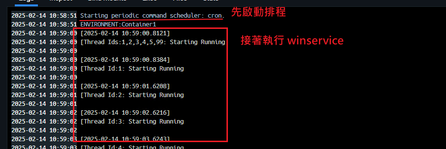

#### docker-compose

```yaml
version: '3.8'

services:
  app:
    image: mycontainer
    entrypoint: ["/bin/sh", "-c", "service cron start && exec \"$0\" \"$@\""]
    command: ["/app/WinService", "--default-option"]
```

### dockerignore

1. 存放路徑，方案根目錄，與 sln 同位置，命名 `.dockerignore`

2. `.dockerignore` 只在 **`COPY . .`**（即整包複製）時發揮作用。

   舉例: COPY ["StoreApi/StoreApi.csproj", "StoreApi/"]

   不會參考 `.dockerignore`，因為這是精確指定路徑，與 `.dockerignore` 無關。

3. dockerignore 有助於

   - 避免把 `bin/`, `obj/`, `.git/` 等無用檔案放入 context。
   - 減少 Docker 傳輸與 build context 的大小。
   - 加速 `COPY . .` 步驟。

4. 沒有設置會發生什麼事?

   第 2 點說明了`.dockerignore` 只在 **`COPY . .`**（即整包複製）時發揮作用。

   沒有忽略路徑，當前目錄如果太多或太大，就會 build 非常久，甚至是卡住不會動

   1. 太多檔案 : `.git`, `node_modules`, `dist`, `.output`, `.next`, `*.log`, `.DS_Store`, ...
   2. 太大檔案 : 影片、照片、build 出來的 artifacts

5. Net 的 .dockerignore

   ```dockerfile
   **/.classpath
   **/.dockerignore
   **/.env
   **/.git
   **/.gitignore
   **/.project
   **/.settings
   **/.toolstarget
   **/.vs
   **/.vscode
   **/*.*proj.user
   **/*.dbmdl
   **/*.jfm
   **/azds.yaml
   **/bin
   **/charts
   **/docker-compose*
   **/Dockerfile*
   **/node_modules
   **/npm-debug.log
   **/obj
   **/secrets.dev.yaml
   **/values.dev.yaml
   LICENSE
   README.md
   !**/.gitignore
   !.git/HEAD
   !.git/config
   !.git/packed-refs
   !.git/refs/heads/**
   ```

6. Nuxt 3 的 .dockerignore

   ```dockerfile
   # 基本忽略
   node_modules
   .git
   .gitignore
   Dockerfile
   .dockerignore
   npm-debug.log
   pnpm-debug.log
   yarn-error.log
   *.tsbuildinfo
   
   # Nuxt 3 編譯相關
   .output
   .nuxt
   dist
   .cache
   coverage
   
   # Vite / build cache
   .vite
   *.log
   
   # OS / IDE 垃圾
   .DS_Store
   Thumbs.db
   *.swp
   .idea
   .vscode
   *.local
   ```

   

## Docker Desktop

### Install 

1. 下載 docker desktop (以系統管理員執行)

2. 手動更新 WSL

   如果開啟安裝檔沒有點選到以系統管理員執行，需要補作 WSL 安裝

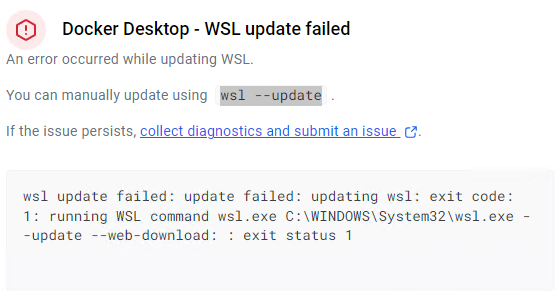

WSL安裝需要Administrator 權限，所以需要另外開啟管理員身分下載WSL

```
wsl --update
```

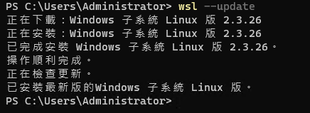

### setting process

處理設定

#### Start Docker Desktop when you sign in to your computer

General > Start Docker Desktop when you log in

方便電腦有不確定重啟或更新時，docker 重啟

#### Enable Docker terminal

General > Enable Docker terminal

cli 控制 docker 下上 方便 cicd 整合

#### Enable Kubernetes

Kubernetes > Enable Kubernetes

本地開發和測試 Kubernetes 集群

#### General > Choose container terminal

General > Choose container terminal

Integrated or System default

| 用途/需求                                                    | 建議選擇           |
| ------------------------------------------------------------ | ------------------ |
| **希望一切都在 Docker Desktop 中完成<br />日常操作以圖形界面為主** | **Integrated**     |
| **需要靈活使用 CLI 和腳本**<br />**進行高級終端操作或多工具整合** | **System default** |

------

**建議的選擇**：

- 如果你是 **新手** 或主要使用 **Docker Desktop 界面**：選擇 **Integrated**，方便操作。
- 如果你是 **開發者** 或需要 **高靈活性與腳本化** 操作：選擇 **System default**。

#### General > Expose daemon 

General > Expose daemon 

Expose daemon on tcp://localhost:2375 without TLS

for 外部使用連線

同為 tcp://host.docker.internal:2375

#### Enable host networking- Container shared host net work

Resource> network

Enable host networking

不需要 docker compose 一筆一筆規劃 network 相連，設此使所有 container 都相通

#### 使容器可以掛載外部容器 (系統管理員身分執行)

在 PowerShell 中，运行以下命令来启动 `com.docker.service`：

此時啟動狀態是 `手動` manual

```powershell
Start-Service com.docker.service
```

設置使其`自動`啟動

```powershell
Set-Service -Name com.docker.service -StartupType Automatic
```

檢查有沒有執行起來

```powershell
Get-Service com.docker.service | Select-Object -Property Name, StartType
```

#### docker Engine daemon.json

檔案路徑: `C:\Users\userName\.docker\daemon.json`

```json
{
  "builder": {
    "gc": {
      "defaultKeepStorage": "20GB",
      "enabled": true
    }
  },
  "experimental": false,
  "hosts": [
    "tcp://0.0.0.0:2375"
  ],
  "insecure-registries": [
    "host.docker.internal:5000",
    "192.168.10.10:5000"
  ]
}
```

##### hosts": [  "tcp://0.0.0.0:2375"]

TCP 方式暴露 Docker Daemon 的 API
設置令 docker 內部的 container ，可以透過設置 \- DOCKER_HOST=tcp://host.docker.internal:2375 
container 可以直接取用宿主機的 docker engine
避免 container 需要安裝 docker engine 而形成 docker 嵌套 影響效能

2375 是 http 

2376 是 https

如果設置2375，還需要 enable `setting > General > Expose daemo`

設置後防火牆開啟對外 port

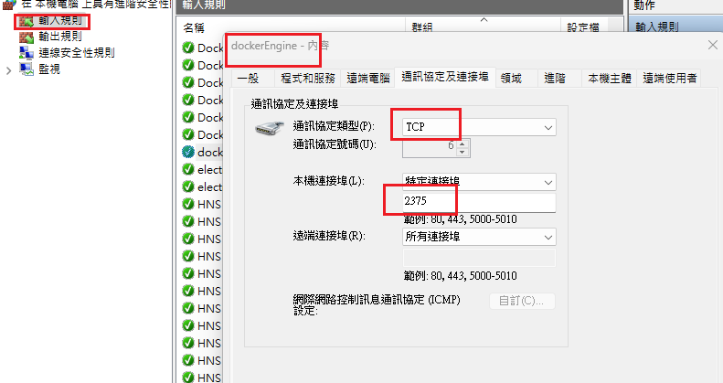

##### "insecure-registries": [  "localhost:5000","192.168.10.10:5000" ]

 pull registry 可以 http 的允許白名單
如 registry 是私架沒有使用憑證，要開啟才能pull
否則會優先使用 https 在docker hub 尋找

localhost:5000 是對應 docker registry 建在本機 docker 對外設置 port 5000
192.168.10.10:5000 是對應 docker registry 建在目標 server docker 對外設置 port 5000

#### .wslconfig

位置 %USERPROFILE%/.wslconfig
限制 VmmemWSL 佔據 server memory 資源
開發環境可以限縮 memory 給個 1GB 就好
目標 server 不要限制 memory 縮小 swap 就好

```shell
[wsl2]
# 配置WSL的核心數
processors=2
# 配置WSL的內存最大值
# memory=512MB
# 配置交換內存大小，預設是電腦內存的1/4
swap=8GB
# 關閉默認連接以將WSL 2 本地主機綁定到 Windows 本地主機
localhostForwarding=true
# 設置臨時文件位置，預設 %USERPROFILE%\AppData\Local\Temp\swap.vhdx
# swapfile=D:\temp\wsl-swap.vhdx
```

保存後以系統管理員打開 powershell，執行

```powershell
wsl --shutdown
```

重啟 Docker Desktop

#### Switch to Linux containers

運行小 icon >> 右建

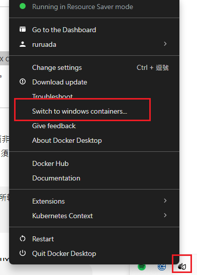

Docker Desktop 執行的 Linux 容器是由 Docker Engine 維護，但在 Windows 上，這些容器依賴 WSL 2 或 Hyper-V 提供 Linux Kernel 支援，因此間接依賴虛擬化技術。

1. 不同的容器平台需求

   - **Linux 容器**：預設在大多數場景中使用，因為絕大多數 Docker 容器都是基於 Linux 架構。

   - **Windows 容器**：如果你的應用程式是基於 Windows 平台（如 .NET Framework、IIS 等），需要使用 Windows 容器來運行。


2. **支援 Windows 環境的應用程式**
   有些應用無法在 Linux 容器中執行，例如 Windows 原生的服務或依賴 Windows API 的應用程式。

5. **在 Windows 上，Linux 容器仍需要一個 Linux Kernel**

   Windows 作業系統本身並不支持原生的 Linux Kernel，因此 Docker Desktop 必須依賴一個「虛擬化層」來提供 Linux Kernel：
   - **WSL 2**（Windows Subsystem for Linux 2）：目前最常見的方式，Docker Desktop 預設使用 WSL 2 虛擬機來運行 Linux 容器。
   - **Hyper-V 虛擬機**：在不支援 WSL 2 的舊版 Windows 上（如 Windows 10 Home），Docker Desktop 會使用 Hyper-V 技術創建一個輕量級虛擬機來運行 Linux Kernel。

6. **Linux 容器與虛擬機的區別**
   - 雖然容器並不是完整的 VM，但在 Windows 上運行 Linux 容器時，仍然需要通過虛擬化技術提供 Linux Kernel。
   - 這意味著，在 Windows 上，Docker Desktop 實際上依賴 WSL 2 或 Hyper-V（這些本身是虛擬機技術），但它們僅用於提供 Linux Kernel，而非完整的 VM 環境。

##### **Docker Desktop 在不同情況下的架構：**

1. **Linux 系統：**
   - Docker Engine 直接運行在主機作業系統上，完全不需要虛擬化。
   - Linux Kernel 本身即為容器提供支援。
2. **Windows 系統：**
   - 預設使用 WSL 2 技術，內部是一個輕量級的 Linux 虛擬機（由 WSL 2 提供）。
   - 在舊版 Windows 系統上（不支援 WSL 2），Docker Desktop 則使用 Hyper-V 創建一個輕量級 VM。

##### **如何檢查 Docker Desktop 使用的虛擬化方式：**

- 打開 Docker Desktop，進入「Settings > General」：
  - 如果看到 **"Enable the WSL 2 based engine"** 被啟用，說明正在使用 WSL 2 虛擬機。
  - 如果沒有啟用 WSL 2，則默認使用 Hyper-V。

## Image

### pull image

```powershell
### get image / get ubuntu os from docker hub
get docker hub exist image
#指定版本
docker pull ubuntu:16.04
#不選版本預設會找最新
docker pull ubuntu
#相當於
docker pull ubuntu:latest
```
push 一個自己的 image 到 dockerhub 就可以測試 pull 下來
```
docker pull ruruada/mydockertest:v2
```

### build Image

reference Dockerfile (build image)

### check images

docker images

docker image ls

### copy image

dparcore:dev 複製且 rename 192.168.10.10:5000/itsower/dparcore:dev

```powershell
docker tag dparcore:dev 192.168.10.10:5000/itsower/dparcore:dev

# rename 
docker tag ruruada/mydockertest:v1 ruruada/mydockertest:v2
```

### push image

目標 push 到遠端 image server/ComapnyName/name:tag (注意 name tag 全小寫)

```
docker push 192.168.10.10:5000/itsower/dparcore:dev
```

### delete image

```powershell
# 清理 -a all 所有沒有在使用的 image
docker image prune -a

# 清理 -a all 所有沒有在使用的 image -f 取消交互確認
docker image prune -a -f

# 刪除 指定 image 名稱
docker rmi training/sinatra
```

### save image to local (export image)

```powershell
docker save -o mydockertest.tar ruruada/mydockertest
```

### get image from local (import image)

```powershell
docker load --input mydockertest.tar
docker load < mydockertest.tar ( seams not work)
```

### check image history

docker history ubuntu

docker history <imageName>

## Container

### run container via compose

reference docker-compose (run container)

### run container via cli

#### with random name

```
docker run -t -i ubuntu:12.04 /bin/bash
```

沒有的 container 也可以直接 run, 會直接找 docker hub pull 

`-i`：這個參數表示交互式模式（Interactive Mode）。當您在容器中運行一個命令時，可以使用此選項來保持與容器的交互。例如，如果您運行一個 shell，您可以在容器中輸入命令並查看輸出。 

`-t`：這個參數表示終端模式（TTY Mode）。它為容器分配一個虛擬終端，使您可以在容器中運行交互式命令行工具，如 shell。通常與 -i 一起使用。

相當於 compose

```
stdin_open: true 
tty: true 
```

#### asigned name and ports

```
docker run -d --name myTest -p 8080:80 ubuntu:12.04 /bin/bash
```

`-d` 代表在 Detached（ 背景 ）執行，如不加 `-d`，預設會 foreground ( 前景 ) 執行

1. Detached（後台）運行：

   當你以 Detached 模式運行容器時（使用 -d 標誌），容器將在後台運行，不會佔用你的終端或命令行界面。 你可以繼續在同一終端執行其他命令，而不會被容器進程阻塞。 如果你關閉了終端或者退出了當前會話，容器仍然會繼續運行。 可以使用 docker logs <container_name> 命令來查看容器的輸出日誌。

2. Foreground（前台）運行：

   當你以 Foreground 模式運行容器時（即不使用 -d 標誌），容器會佔據你當前的終端或命令行界面。 你將會看到容器的輸出，包括標準輸出和標準錯誤輸出，直接顯示在終端上。 如果你關閉了終端或者退出了當前會話，容器也會相應地停止運行。 你可以通過 Ctrl+C 來停止容器的運行。

`-p` 代表將本機的 80 port 的所有流量轉發到 container 中的 80 port

`--name` 設定 container 的名稱

### check container

docker ps 查看執行中 container

docker ps -a 查看所有 container

### check container logs

docker logs  <containerName> 查看容器輸出日誌

docker logs -f <containerName> 查看輸出日誌 繼續輸出不跳出

### remove container

docker rm <containerName>

### cli run container 

```shell
docker run -it --rm azure-agent:dev /bin/bash

進入交互模式
docker exec -it azure-agent bash

遠端 docker host 進入交互模式
cmd /c "set DOCKER_HOST=tcp://192.168.10.10:2375 && docker exec -it azure-agent bash"
cmd /c "set DOCKER_HOST=tcp://192.168.10.10:2375 && docker exec -it dparcore-batch bash"

遠端 docker host 進入且執行 Batch 交互模式
cmd /c "set DOCKER_HOST=tcp://192.168.10.20:2375 && docker exec -it dparcore-batch dotnet /app/Batch.dll"
```

使用 cmd

```shell
# 進入遠端容器
set DOCKER_HOST=tcp://192.168.10.10:2375
docker exec -it dparcore-web bash

# 進入遠端docker host 查看所有 images
set DOCKER_HOST=tcp://192.168.10.10:2375
docker ps

```


### monitor container cpu and memory usage

即時監控 container 

```
docker stats
```

更詳細的數據

```
# 尋找 MemoryStats 相關資訊 
docker inspect
```

before limit

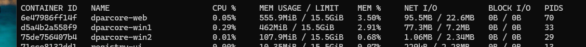

after limit


## Dockerfile (build image)

### before build

檢查 .dockerignore，沒有就必須建立一個

reference Docker/Concepts/dockerignore

### Image process

#### build

```powershell
# build image 出來是 <none> 沒有名字 測試用的 build
docker build -t weather .

# 可以輸出錯誤 已確認建置問題出在哪個環節
docker build . progress=plain

# 指定 image name:tag (注意 name tag 全小寫)
docker build . -t dparcore:dev
docker build . -t carcare-storeweb:dev

# 指定 build 不要使用 cache 完全重建 debug 時清乾淨使用
docker build . --no-cache -t azure-agent:dev

# 指定 dockerfile 位置 建置專案參考外部專案，需要上層資料夾時使用
# -f 指定 dockerfile 位置 
# -t image name tag
# . 指定 dockerfile 內部構建上下文的目錄
docker build -f ./StoreApi/Dockerfile -t carcare-storeapi:dev .
docker build -f ./Web/Dockerfile -t dparcore:dev .
docker build -f ./WinService/Dockerfile -t dparcore-win:dev .
docker build -f ./nginx/Dockerfile -t carcare-nginx-proxy:dev .
# 等於跟空格是一樣意思 以下意思都一樣
-t="weather"
-t=weather
-t weather
```

#### run 

Cli 執行,檢查跑起來的 container 有沒有問題, 確定沒有問題之後可以直接編輯在 compose 上, 已記錄正確的run 參數

```
docker run -d -p 5288:80 weather
```


### .dockerignore (Solution/.dockerignore)


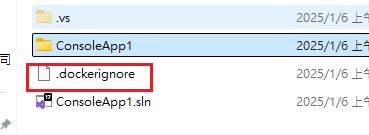

#### Dockerfile (Solution/Application/Dockerfile)


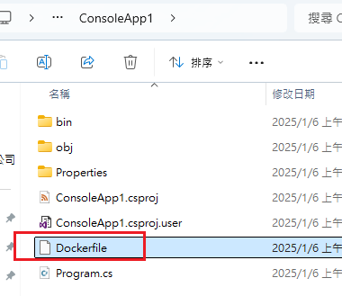

visual stidio vs .sin 項下的檔案查看使用

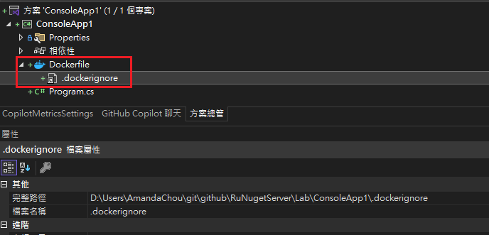

### Net App 範例

#### Edit Dockerfile

sln 項下維護 Dockerfile

```dockerfile
FROM mcr.microsoft.com/dotnet/aspnet:6.0 AS base
WORKDIR /app
EXPOSE 80
EXPOSE 443

FROM mcr.microsoft.com/dotnet/sdk:6.0 AS build

# install Node.js
RUN apt-get update && \
    apt-get install -y curl && \
    curl -fsSL https://deb.nodesource.com/setup_18.x | bash - && \
    apt-get install -y nodejs

WORKDIR /src

COPY . .
WORKDIR "/src/Web"
RUN dotnet restore "Web.csproj"
RUN dotnet build "Web.csproj" -c Release -o /app/build

FROM build AS publish
RUN dotnet publish "Web.csproj" -c Release -o /app/publish /p:UseAppHost=false

FROM base AS final
WORKDIR /app
COPY --from=publish /app/publish .

ENV ASPNETCORE_ENVIRONMENT=Container # 指定鏡檔環境變數，但建議還是使用在 compose 指定較好

ENTRYPOINT ["dotnet", "Web.dll"]
```

proj 項下維護 Dockerfile

```dockerfile
FROM mcr.microsoft.com/dotnet/sdk:6.0 AS build-env
WORKDIR /sourceCode

# Copy 當前dockfile所有檔案(.) 到 build-env根目錄(./,或者.也可以)
COPY . ./

# Restore as distinct layers
RUN dotnet restore
# Build and publish a release
RUN dotnet publish -c Release -o out

# Build runtime image
FROM mcr.microsoft.com/dotnet/aspnet:6.0
WORKDIR /buildedCode
COPY --from=build-env /sourceCode/out .
ENTRYPOINT ["dotnet", "webApp.dll"]
```

#### build run

### MySql

#### Edit Dockerfile

利用現有 image 執行 MySql 
可以被 compose 取代

```dockerfile
# Use the official MySQL image from Docker Hub
FROM mysql:latest

# Set environment variables
ENV MYSQL_ROOT_PASSWORD=2234
ENV MYSQL_DATABASE=InitDB
ENV MYSQL_USER=ruru
ENV MYSQL_PASSWORD=2234

# Copy the SQL script to initialize the database
COPY InitDB.sql /docker-entrypoint-initdb.d/

# Expose the MySQL port
EXPOSE 3306

# Start MySQL service automatically when the container starts
CMD ["mysqld"]
```

#### build run

build

```
docker build -t cmdb_mysql .
```

run

```
docker run -d -p 5367:3306 --name cmdb cmdb_mysql
```

#### dbever check data

使用 dbever 測試 container 的 sql 連線狀況

編輯連接>驅動屬性

設定這個就可以了 : allowPublicKeyRetrieval to `true` 

這個不設也可以連 : useSSL to `false`

### ubuntu OS

#### Edit Dockerfile

利用現有 image 執行 ubuntu OS
可以被 compose 取代

```dockerfile
#Download base image ubuntu 16.04
FROM ubuntu:16.04

MAINTAINER Docker Amanda <AmandaChou@itsower.com.tw>

# Update Software repository
RUN apt-get update

# Configure Services and Port
COPY start.sh /start.sh
CMD ["./start.sh"]

EXPOSE 80 443
```

#### build run

build

透過 dockerfile 建立 image 並執行 container -t=<containerName>

. means current path, you can replace to your Dockerfile path and no need to cd location

do remember image name only accept lowercase (in this case mydockertest)

```powershell
# 先cd 到 dockerfile 位置執行
docker build -t="ruruada/mydockertest:v1" .
```

`-t` tag 意即建立一個<name>的 image

run

```
docker run "ruruada/mydockertest:v1"
```

## docker-compose run container

### run container

```powershell
# run container
docker-compose up

# run container 背景執行 Detached Mode 避免佔據當前終端
docker-compose up -d

# run container 指定 Project name 而不使用當前資料夾名稱
docker-compose -p carcare up -d

# Linux/macOS agent pipeline 指定 Project name
export COMPOSE_PROJECT_NAME=$(projectName)

# Windows agent pipeline 指定 Project name
# by powshershell
$env:COMPOSE_PROJECT_NAME = "$(projectName)"
# by cmd
set COMPOSE_PROJECT_NAME=$(projectName)

# 指定 compose 位置
docker-compose -f ./Web/docker-compose.yml up -d
docker-compose -f ./WinService/docker-compose.yml up -d
```

1. 可以版控 container 執行的參數(對外port、環境變數、是否背景執行等)
2. 依賴可執行的 image，執行 container 取代 Dockerfile cli
3. 組成 container 模式，故會形成叢集資料夾 container 分層方式顯示

複製 ReadingNote\Devops\.attach\.docker\Volumes
到 D:\Users\AmandaChou\Volumes

開始所有 compose file 的維護與執行

### before run

確定拿到的是最新的 image `docker-compose pull`

刪掉 **所有「未被容器使用的 image」**，包含你之前 build 或 pull 下來、但目前沒有 container 用到的

### after run

確定本地沒有用不到的 `image docker image prune -a -f`

## CICD support container prepare

via docker compose realize

### azure agent and docker registry

```powershell
cd C:\Users\Administrator\Volumes\azure-agent
# build image
docker build . -t azure-agent:dev
# run container
docker-compose up -d
```

### docker registry

1. cd 到 complose 位置

   `cd D:\Users\AmandaChou\Volumes\dockerrepos`

2. 檢查 complose 存在

   `ls`

3. 執行

   `docker-compose up -d`

4. 檢查容器是否執行

   `docker ps`

#### 查看現有 registry image

```powershell
curl http://localhost:5000/v2/_catalog
```

#### 查看現有 image 現有 tag

```powershell
curl http://localhost:5000/v2/imagename/tags/list
curl http://localhost:5000/v2/dparcore/tags/list
```

#### vs code ide 方式查看

extension 安裝 


新增連線


選擇 v2 


port 使用 container 對外 port

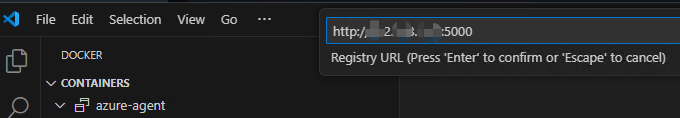

沒有設置 username 與 passeword 就跳過


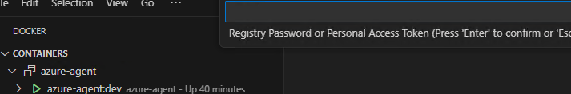

連上就可以看已經push 的 image


### BeGat build

1. cd 到 complose 位置

   `cd D:\Users\AmandaChou\Volumes\nuget`

2. 檢查 complose 存在

   `ls`

3. 執行

   `docker-compose up -d`

4. 檢查容器是否執行

   `docker ps`

#### 檢測是否穩定運行

http://localhost:29/

#### 舊主機套件轉移

1. 將舊主機的套件複製packages

2. 套件移動到 Volumes\nuget\Packages

3. ps 路徑執行.`.\SyncSource.ps1`

   可能需要先執行 : Set-ExecutionPolicy -Scope Process -ExecutionPolicy RemoteSigned

   可能需要先下載 nuget.exe https://learn.microsoft.com/zh-tw/nuget/install-nuget-client-tools?tabs=windows

   可能需要去 %APPDATA%/NuGet/NuGet.Config 新增 <add key="63ITSbegat" value="http://192.168.10.10:29/v3/index.json" allowInsecureConnections="True" />

### MSSQL build

1. cd 到 complose 位置

   `cd D:\Users\AmandaChou\Volumes\mssql`

2. 檢查 complose 存在

   `ls`

3. 執行

   `docker-compose up -d`

4. 檢查容器是否執行

   `docker ps`

5. 進入容器

   docker exec -it sqlserver_1437 bash

6. 進入容器使用容器內 cli 工具

   docker exec -it sqlserver_1437 /opt/mssql-tools18/bin/sqlcmd -S tcp:localhost  -U sa -P "mysettingpassword" -C

#### 測試 SSMS 連線

localhost,1436 

192.168.10.10,1436

sa

mysettingpassword

#### 檢查 mdf、ldf 掛載

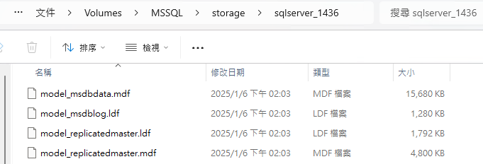

#### 進入容器

 docker exec -it sqlserver_1437 bash

#### 進入容器 sql cmd

##### server 進入

docker exec -it sqlserver_1437 /opt/mssql-tools/bin/sqlcmd -S tcp:localhost  -U sa -P "mysettingpassword" -C

docker exec -it sqlserver_1437 /opt/mssql-tools18/bin/sqlcmd -S tcp:localhost  -U sa -P "mysettingpassword" -C

docker exec -it sqlserver_1437 /opt/mssql-tools18/bin/sqlcmd -S tcp:localhost  -U sa -P "mysettingpassword" -C -l 30

docker exec -it sqlserver_1437 /opt/mssql-tools18/bin/sqlcmd -S tcp:localhost,1433  -U sa -P "mysettingpassword" -C -l 30

##### 遠端進入

#### 查看檔案

#### 應用程式連線

1. bakpac 還原

   資料庫設定不見

   1. Autogrowth 設定、還原變為預設值

      ```sql
      SELECT
          name AS FileName,
          type_desc AS FileType,
          size / 128 AS CurrentSize_MB,
          growth AS GrowthSetting,
          is_percent_growth AS IsGrowthInPercent
      FROM
          sys.database_files;
      ```

   2. 其他gpt建議檢察(但我檢查沒有變化)

      ```sql
      SELECT name
      , recovery_model_desc
      , compatibility_level
      ,is_auto_close_on
      ,page_verify_option
      FROM sys.databases
      WHERE name = 'DPARCore2';
      ```

      

2. bak 或 bakpac 還原

   需要手動刪除 login

   刪不掉是因為有SCHEMA占用

   檢查占用

   ```sql
   SELECT name AS SchemaName
   FROM sys.schemas
   WHERE principal_id = USER_ID('dpar');
   ```

   刪除占用

   ```sql
   ALTER AUTHORIZATION ON SCHEMA::dpar_schema TO dbo;
   ```

   手動刪除使用者

3. 加回使用者連線

   ```sql
   USE [master]
   GO
   CREATE LOGIN [dpar] WITH PASSWORD=N'dpar', DEFAULT_DATABASE=[master], CHECK_EXPIRATION=OFF, CHECK_POLICY=OFF
   GO
   USE [DPARCore2]
   GO
   CREATE USER [dpar] FOR LOGIN [dpar]
   GO
   USE [DPARCore2]
   GO
   ALTER ROLE [db_owner] ADD MEMBER [dpar]
   GO
   ```

   

### Verdaccio


A lightweight Node.js private proxy registry

#### Verdaccio build

```cmd
#進入有 compose 的 資料夾
cd D:\Users\AmandaChou\Volumes\verdaccio

#檢查檔案存在
ls

# run 起來
docker-compose up -d

# 檢查 docker 裡面有增加檔案
#1
docker exec -it verdaccio sh

#2 -a 才可以看到隱藏的檔案
ls -a /verdaccio/storage

```

檢查檔案存在

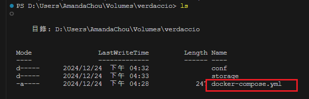

確保目錄中包含 `docker-compose.yml`

compose up 之後新增了一個 .verdaccio-db.json


#### Test into

http://localhost:4873/

local 的 port 4873 對應到 docker container 內部的port  4873

因為compose 設定如此
 ports:

   \- "4873:4873"

### Portainer 

user : admin

pass: itsowermysettingpassword

密碼 必須12字元

### Compose Error

1. port is already allocated

   對外 port 必須唯一，port  號占用會顯示錯誤，回頭修改 compose file

   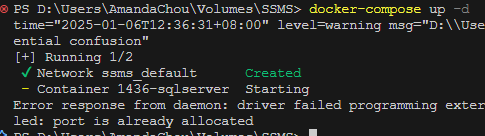

2. Docker login Fail

   當多視窗 cli 執行 docker compose 時，可能導致一個 process 背景取得 docker 的 user credential 而其他 process 無法登入

   應盡量避免多 cli 執行

   : failed to resolve reference "docker.io/verdaccio/verdaccio:latest": failed to authorize: failed to fetch oauth token: unexpected status from GET request to https://auth.docker.io/token?scope=repository%3Averdaccio%2Fverdaccio%3Apull&service=registry.docker.io: 401 Unauthorized

   

    `docker login -u loginDockerUser`

   然後輸入密碼

   


### compose Resource Limit

限制 container 

```yml
services:
  dparcore-web:
    image: 192.168.10.10:5000/dparcore:latest
    deploy:
      resources:
        limits:
          memory: 1024M 
          cpus: "1"
        reservations:
          memory: 256M
          cpus: "0.5"
```


### compose Log Limit

```yml
services:
  dparcore-web:
    image: 192.168.10.10:5000/dparcore:latest
    logging:
      driver: "json-file"
      options:
        max-size: "10M"
        max-file: 5
```


## Registry

### Docker hub Registry

### Registry ui


### Harbor ( registry server and ui solution )

企業自行架設一個只有公司內部可以存取到的 私人Docker Hub，是一個 Open Source 的 Docker Registry

https://github.com/goharbor/harbor

透過Docker Compose架設Harbor

- 修改 hostname (假設 your-domain.com)

- 修改 https.certificate 與 https.private_key (從前一個步驟 Caddy 啟動以後可以自動產生對應的 crt 與 key 檔案)

- 修改 harbor_admin_password 預設密碼

- 修改 database.password 預設密碼

- 調整 data_volume 資料存放位置

  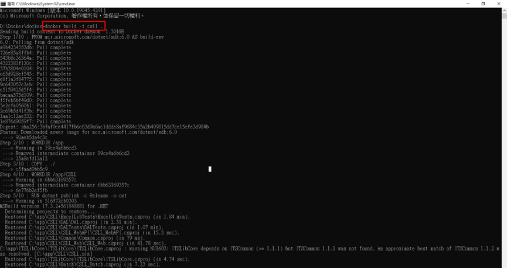


## Debug Container

### VisualStudio 

當前 2022 版本的 docker 支援性沒有很好，你需要相信你的 launchSetting 並多次重開 vs ide

#### 檢查 docker desktop 是否開啟並正確運行中

檢查

#### 需要指定 container os

如欲錯誤: 您的 Docker 伺服器主機已為 'Linux' 進行設定，但專案的目標為 'Windows'。

```C#
  <PropertyGroup>
    <DockerDefaultTargetOS>Linux</DockerDefaultTargetOS>
  </PropertyGroup>
```

#### 需要安裝 nuget

ide 會自己跳出安裝提醒，如果沒有則需要手動安裝

```c#
<PackageReference Include="Microsoft.VisualStudio.Azure.Containers.Tools.Targets" Version="1.21.0" />
```

#### 容器化工作檢查必要條件

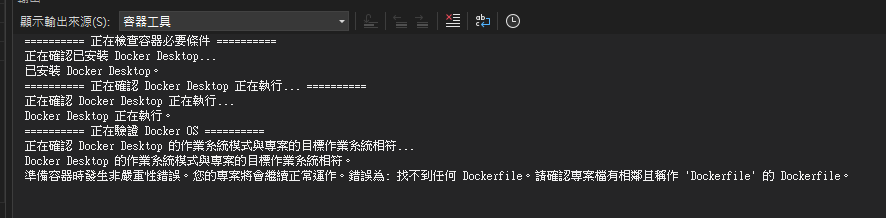

#### launchSetting

```json
 {
  "profiles": {
    "Docker": {  
     "commandName": "Docker",  //設置這個才會執行 Containerainer
     "launchBrowser": true,
     "launchUrl": "{Scheme}://{ServiceHost}:{ServicePort}", //launchBrowser true 就醫定要給
     //"containerName": "dparcore-web", //設置 containerName 沒有用，最終Container 還是吃 .csproj 的名字
     "environmentVariables": {
       "ASPNETCORE_ENVIRONMENT": "Container", //對應容器使用的 appsetting 的配置
       "ASPNETCORE_URLS": "http://+:80", //只能指定 80 開啟 443 會有找不到憑證的錯誤，但container 還是會有 443 對外 port 服務,不過無法使用
       "DOTNET_USE_POLLING_FILE_WATCHER": "1"
     },
     "publishAllPorts": true,
     "dotnetRunMessages": true, //專案自訂的設定 與 Debug Container 無關
     "httpPort": 5034,
     "sslPort": 7034, //不給的話 會隨機指派可用 port 但因為 useSSL false 所以不可用
     "useSSL": false
   	}
  }
}
//web
    "Web_Docker": {
      "commandName": "Docker",
      "containerName": "dparcore-web",
      "environmentVariables": {
        "ASPNETCORE_ENVIRONMENT": "Container",
        "ASPNETCORE_URLS": "http://+:80",
        "DOTNET_USE_POLLING_FILE_WATCHER": "1"
      },
      "publishAllPorts": true,
      "dotnetRunMessages": true,
      "httpPort": 5034,
      "useSSL": false
    }
// Batch
{
 "profiles": {
 "Batch_Docker": {
   "commandName": "Docker",
   "commandLineArgs": "2 N 5",
   "environmentVariables": {
     "DOTNET_ENVIRONMENT": "Container1",
     "DOTNET_USE_POLLING_FILE_WATCHER": "1"
   },
   "containerName": "dparcore-batch",
   "dotnetRunMessages": true
 }
 }
}
```

#### attach process

(目前嘗試的結果是，一完成附加工作，IDE 就當掉，container 也一直轉圈，沒辦法好好使用，不確認原因)

參考: https://learn.microsoft.com/en-us/visualstudio/debugger/attach-to-process-running-in-docker-container?view=vs-2022

先確認 要偵錯的 container 已啟用，且可以執行

偵錯>> 附加至處理緒

連線類型 :Docker (Linux 容器)

連線目標: 尋找按鈕>> 本機電腦>>找到要偵錯的 container >> 確定

程式碼類型: 受控( .Net Core for Unix ) 代碼

附加按鈕

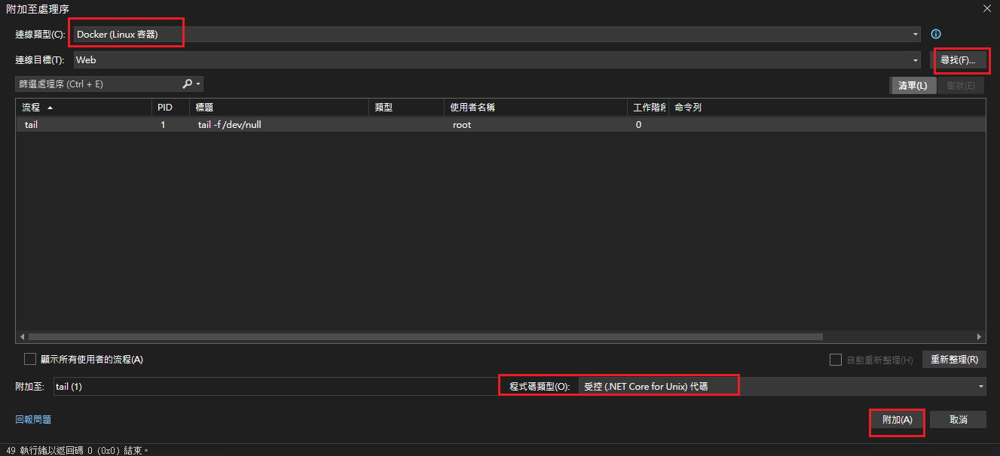

# Kubernetes 

### 核心功能

1. **自動容器部署與管理（Deployment）**
2. **自動容器重啟與恢復（Health Check）**
3. **水平自動擴縮容器（HPA）**
4. **服務發現與負載平衡（Service）**
5. **滾動更新與回滾（Rolling Update / Rollback）**
6. **集中設定與機密管理（ConfigMap / Secret）**
7. **持久儲存掛載（PVC / PV / StorageClass）**
8. **資源限制與 QoS 控管（CPU / Memory 限制）**
9. **工作排程與執行（CronJob / Job）**
10. **命名空間隔離（Namespace）**

### 維運與觀測

1. **集中日誌、監控、告警整合（EFK / Prometheus / Grafana）**
2. **自動 IP 管理與內建 DNS（kube-dns / CoreDNS）**
3. **支援 TLS、自動簽章與更新（cert-manager）**
4. **透過 Helm 管理套件與版本（Helm Chart）**
5. **跨叢集與異地部署支援（多 Region）**

### 安全與穩定性

1. **RBAC 權限控管**
2. **NetworkPolicy 網路存取控管**
3. **Pod 故障自動替換 / 隔離**
4. **節點資源耗盡自動分配與排程**
5. **支援 CI/CD、GitOps 流程（ArgoCD / Flux）**

## 安裝 


### Kubernetes apply

* 代表安裝dashboard2.7的版本

```bash
kubectl apply -f https://raw.githubusercontent.com/kubernetes/dashboard/v2.7.0/aio/deploy/recommended.yaml
```

#### dashboard設定檔

* 代表開啟設定檔

```bash
kubectl edit deployment kubernetes-dashboard -n kubernetes-dashboard
```

* 一開始是沒有紅框裡面的東西的，所以它會自動將 dashboard 登出，就算 token 還沒過期也是一樣
* 加入紅框的文字代表不會自動登出，如果超出token時間會報401
* 注意排版跟參數對不對，如果不對不會讓你修改
  ![[Pasted image 20240424174301.png]]

#### login設定檔

* 這個是可以看到所有東西的使用者設定檔

```yaml
apiVersion: v1
kind: ServiceAccount
metadata:
  name: admin-user
  namespace: kubernetes-dashboard
```

* 創建登入用token
* 預設為1個小時

```bash
#下面會創建一個3個小時過期的token
kubectl -n kubernetes-dashboard create token admin-user --duration=3h
#下面會創建一個2天過期的token
kubectl -n kubernetes-dashboard create token admin-user --duration=2d
```

#### 啟動

* 預設是在localhost:8001
* http://localhost:8001/api/v1/namespaces/kubernetes-dashboard/services/https:kubernetes-dashboard:/proxy/#/login

```bash
kubectl proxy
```

#### 參考資料

1. 安裝
   [Running Kubernetes and the dashboard with Docker Desktop (andrewlock.net)](https://andrewlock.net/running-kubernetes-and-the-dashboard-with-docker-desktop/)
   [dashboard/aio/deploy/recommended.yaml at v2.7.0 · kubernetes/dashboard · GitHub](https://github.com/kubernetes/dashboard/blob/v2.7.0/aio/deploy/recommended.yaml)
2. dashboard設定檔
   [kubernetes dashboard - How can I make the automatic timed logout longer? - Stack Overflow](https://stackoverflow.com/questions/58012223/how-can-i-make-the-automatic-timed-logout-longer)
3. login設定檔
   [dashboard/docs/user/access-control/creating-sample-user.md at master · kubernetes/dashboard · GitHub](https://github.com/kubernetes/dashboard/blob/master/docs/user/access-control/creating-sample-user.md)
4. 啟動
   [Running Kubernetes and the dashboard with Docker Desktop (andrewlock.net)](https://andrewlock.net/running-kubernetes-and-the-dashboard-with-docker-desktop/)

### docker desktop 安裝 Kubernetes 

#### install docker desktop

reference Docker Desktop >> install

#### install k8s

Setting >> Kubernetes

1. 先按下紅框處的按鈕
2. 再將綠框處的勾勾勾選起來
3. 最後按下籃框處的紅紐確定安裝
   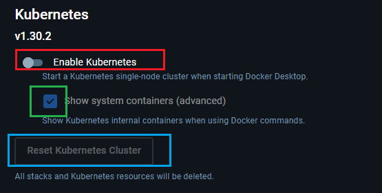

#### 確定k8s安裝成功

##### GUI介面確定

* 紅框處的 ks8 icon 是綠色的就確定有安裝成功

##### CLI介面確定

* 也可以在CLI介面下以下的指令，如果跑出下面的圖片也代表安裝成功

```bash
kubectl version
```

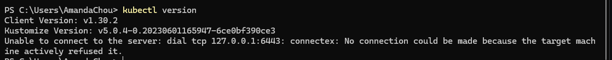

## GUI 

### GUI Kubernetes Dashboard


### GUI Kubernetes Lens


# 容器化工作實例

### agent server 準備

#### 電腦重灌

1. 系統 win11 ,windows 企業版

2. 登入方式:  登入選像>> 改為加入網域 server63  密碼 mysettingpassword

3. 修改電腦名稱 ITS63

4. 開啟遠端連線                                                                               

   遠端桌面設定>> 遠端桌面>>開啟

5. 禁用休眠

   在 Server 設定好之後，如過之後有需要在遠端連線，且避免電腦有自動更新重啟以致於連不上的情境時，需要做此設定需要做此設定。

#### 使用者 administrator

電腦管理> 本機使用者和群組> Administrator 取消禁用 

右鍵 設定密碼 密碼 mysettingpassword

改登入 Administrator 刪除使用者 server63 

### tool 準備

#### 下載 docker desktop

登入使用者 loginDockerUser@gmail.com 密碼 mysettingpassword

> reference Docker Desktop install and setting

target server 依賴 agent server 的 docker registry container 

目前 agent server 的實體位置是 192.168.10.10  insecure-registries 就要加入 agent server ,  這樣 compose up 才不會有問題

#### 下載 ngrok

若 cicd agent 使用 azure devops 預設 vm 服務，需要內網穿透工具來 call 內部 itsnuget 服務

#### 下載 vs code

方便維護 docker compose 與起服務並查看 registry 上下傳狀態

#### 下載 windows terminal


#### 複製 Volumes 到目標主機

reference docker-compose ( run container)

### target server 準備 

#### 下載 docker desktop

1. 登入使用者 帳號 loginDockerUser@gmail.com 密碼 mysettingpassword

> reference Docker Desktop install and setting

2. 設定 windows docker 允許遠端連線 docker host
   1. windows docker desktop  2375 遠端 port : 新增 PortProxy 規則 (以 ip 192.168.10.20 為例)
   
   2. 新增防火牆輸入規則開啟 2375 port
   

pipeline 修改 target server ip (以 ip 192.168.1.91 為例)

```
  dockerhost: 'tcp://192.168.1.91:2375'
```

ap

dpar http://192.168.10.10:5034/
dpar batch cmcm

cmd /c "set DOCKER_HOST=tcp://192.168.10.10:2375 && docker exec -it azure-agent bash"
sql 連線 192.168.10.10,1436

    - D:/dparcore/d:/app/d
    - D:/dparcore/c:/app/c

supercronic|
 docker build -f ./Batch/Dockerfile -t 192.168.10.10:5000/dparcore-batch:latest .

docker push 192.168.10.10:5000/dparcore-batch:latest

#### 遇到電腦重開機

遇到伺服器重開會有錯誤

Cannot connect to the Docker daemon at tcp://192.168.10.20:2375. Is the docker daemon running? 

```
# 開啟 2375 ip 導向 localhost
netsh interface portproxy add v4tov4 listenport=2375 listenaddress=192.168.10.10 connectaddress=127.0.0.1 connectport=2375 protocol=tcp
netsh interface portproxy add v4tov4 listenport=2375 listenaddress=192.168.10.20 connectaddress=127.0.0.1 connectport=2375 protocol=tcp

# 清除所有 ip 導向
netsh interface portproxy reset

# 顯示所有已設定的 ip 導向
netsh interface portproxy show all

# 刪除特定 port 號的導向設定
netsh interface portproxy delete v4tov4 listenport=2375 listenaddress=127.0.0.1

```

```
netsh interface portproxy add v4tov4 listenport=5128 listenaddress=192.168.1.91 connectaddress=127.0.0.1 connectport=5128 protocol=tcp

netsh interface portproxy add v4tov4 listenport=5128 listenaddress=192.168.1.91 connectaddress=127.0.0.1 connectport=9595 protocol=tcp
```

檢查 target server 遠端 docker host 是否可用

```shell
curl http://192.168.10.20:2375/_ping
```

要出現這個畫面才算成功

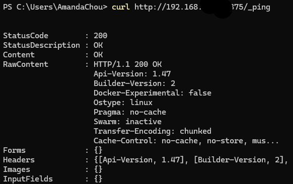

# 專案鏡像化工作與CICD

以 LineCRM.CarCare\StoreApi\StoreApi.csproj 為例

### 1. 測試本地 Server

#### 編輯專案 Dockerfile (位置同 csproj)

```dockerfile
FROM mcr.microsoft.com/dotnet/aspnet:8.0 AS base
USER $APP_UID
WORKDIR /app
EXPOSE 80
EXPOSE 443

FROM mcr.microsoft.com/dotnet/sdk:8.0 AS build

WORKDIR /src
COPY ["nuget.config", "."]
COPY ["StoreApi/StoreApi.csproj", "StoreApi/"]
RUN dotnet restore "./StoreApi/StoreApi.csproj"
COPY . .
WORKDIR "/src/StoreApi"
RUN dotnet build "./StoreApi.csproj" -c Release -o /app/build

FROM build AS publish
RUN dotnet publish "./StoreApi.csproj" -c Release -o /app/publish /p:UseAppHost=false

FROM base AS final
WORKDIR /app
COPY --from=publish /app/publish .
ENTRYPOINT ["dotnet", "StoreApi.dll"]
```

#### 編輯方案 DockerCompose (位置同 sln)

```yaml
services:
  dparcore-web:
    image: carcare-storeapi:dev
    container_name: carcare-storeapi
    environment:
    - ASPNETCORE_HTTP_PORTS=80
    - ASPNETCORE_ENVIRONMENT=Container
    - TZ=Asia/Taipei
    ports:
    - "7728:80"
    - "7729:443"
    volumes:
    - D:/carcare-storeapi/d:/app/d
    logging:
      driver: "json-file"
      options:
        max-size: "10M"
        max-file: 5
    deploy:
      resources:
        limits:
          memory: 1024M
          cpus: "1"
        reservations:
          memory: 256M
          cpus: "0.5"
```

#### 測試本地鏡像化/容器化 (位置同 sln)

```powershell
# 測試本地鏡像化
docker build -f ./StoreApi/Dockerfile -t carcare-storeapi:dev .
# 測試本地容器化
docker-compose up -d
```

#### 本地 Server 測試 image 是否可用

http://localhost:7728/swagger/index.html

理應顯示 Api 測試的 swagger 頁面

### 2. 測試目標 Server

#### 修改專案 Dockerfile (位置同 csproj)

```dockerfile
FROM mcr.microsoft.com/dotnet/aspnet:8.0 AS base
USER $APP_UID
WORKDIR /app
EXPOSE 80
EXPOSE 443

FROM base AS final
COPY ./publish/StoreApi .

ENTRYPOINT ["dotnet", "StoreApi.dll"]
```

#### 編輯方案 DockerCompose (位置同 sln)

```yaml
services:
  dparcore-web:
    image: 192.168.10.20:5000/carcare-storeapi:latest
    container_name: carcare-storeapi
    environment:
    - ASPNETCORE_HTTP_PORTS=80
    - ASPNETCORE_ENVIRONMENT=Container
    - TZ=Asia/Taipei
    ports:
    - "7728:80"
    - "7729:443"
    volumes:
    - D:/carcare-storeapi/d:/app/d
    logging:
      driver: "json-file"
      options:
        max-size: "10M"
        max-file: 5
    deploy:
      resources:
        limits:
          memory: 1024M
          cpus: "1"
        reservations:
          memory: 256M
          cpus: "0.5"
```

#### 編輯方案 pipeline.yml (位置同 sln)

```yaml
trigger:
- docker

pool:
  name: linux-container-agent-pool

variables:
  buildConfiguration: 'Release'
  dockerRegistry: '192.168.10.20:5000'
  projectName: 'carcare'
  storeapiImageName: 'carcare-storeapi'
  dockerImageTag: '1.0.0'
  agentdockerhost: 'host.docker.internal' # agent 使用的 docker host
  targetdockerhost: '192.168.10.20' # target 使用的 docker host


stages:
- stage: BuildAndDockerize
  displayName: 'Build And Dockerize'
  jobs:
  - job: BuildAndDockerize
    displayName: 'Build'
    steps:
    - task: UseDotNet@2
      displayName: 'Install .NET SDK'
      inputs:
        packageType: 'sdk'
        version: '8.x'

    - task: DotNetCoreCLI@2
      displayName: 'Restore Dependencies'
      inputs:
        command: restore
        projects: '**/*.csproj'
        feedsToUse: config
        nugetConfigPath: './nuget.config'

    - task: DotNetCoreCLI@2
      displayName: 'Build Solution'
      inputs:
        command: build
        projects: '**/*.csproj'
        arguments: '-c $(buildConfiguration) --no-restore'

    - task: DotNetCoreCLI@2
      displayName: 'Publish StoreApi'
      inputs:
        command: 'publish'
        projects: 'StoreApi/StoreApi.csproj'
        arguments: '-c $(buildConfiguration) /p:UseAppHost=false -o $(Build.SourcesDirectory)/publish'
        publishWebProjects: false
        zipAfterPublish: false

    - script: |
        echo "Building Docker StoreApi Image..."
        docker build -f ./StoreApi/Dockerfile -t $(dockerRegistry)/$(storeapiImageName):$(dockerImageTag) .
        docker tag $(dockerRegistry)/$(storeapiImageName):$(dockerImageTag) $(dockerRegistry)/$(storeapiImageName)
      displayName: 'Build Docker web Image'

- stage: PushImage
  dependsOn: BuildAndDockerize
  condition: succeeded()
  displayName: 'Build and Push Docker Image'
  jobs:
  - job: DockerPush
    displayName: 'Containerize and Push Docker Image'
    steps:

    - script: |
        echo "No authentication required for Docker Registry..."
      displayName: 'Skip Docker Login'

    - script: |
        echo "Pushing StoreApi Image with version tag..."
        docker push $(dockerRegistry)/$(storeapiImageName):$(dockerImageTag)
      displayName: 'Push StoreApi Image with version tag'

    - script: |
        echo "Pushing StoreApi Image latest"
        docker push $(dockerRegistry)/$(storeapiImageName)
      displayName: 'Push StoreApi Image latest'

- stage: DeployDockerComposeUp
  dependsOn: PushImage
  condition: succeeded()
  displayName: 'Run Docker Compose'
  jobs:
  - job: DockerComposeUp
    displayName: 'Docker Compose Up'
    steps:
    - script: |
        export DOCKER_HOST=tcp://$(targetdockerhost):2375
        export COMPOSE_PROJECT_NAME=$(projectName)
        echo "Docker run container..."
        docker-compose pull
        docker-compose up -d
      displayName: 'Docker run all container'
```

#### 目標 Server 測試 container 是否可用

http://192.168.10.20:7728/swagger/index.html


# 補充問題

## Volumn mount

Volumn 設定是資料掛載的概念，檔案掛檔案，資料夾掛資料夾，


## Nginx

### run 在 server 還是 run 在 container

### run 在 container 打包在 應用的 project 裡還獨立一個

### 一個 nginx 支援一個服務 proxy 還是一個 nginx 做所有 proxy 的工作

一台 server 安裝一台 iis 就做了所有應用服務的 proxy 工作

## Agent

### pipeline server 的 image 管理


### pipeline agent 的 image 管理


如果 agent server 的 Docker Engine 上已存在同名且同 tag 的 image，且 pipeline 使用 `docker build` 搭配 cache（未指定 `--no-cache`），那麼建構過程可能會使用舊有快取，導致 image 未完全更新，尤其 Dockerfile 沒有變動時。

```yaml
    - script: |
        echo "prune local Docker Image..."
         docker image prune -a -f
      displayName: 'clean local docker images'
```

1. 


如果 cicd 同時有兩個甚至3個在執行的時候

這段 step 就會把別的 pipeline 


